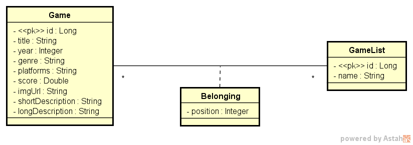

[Português Brasileiro](https://github.com/Gilberto-Mascena/dslist/blob/main/README-pt_br.md) |
[English](https://github.com/Gilberto-Mascena/dslist/blob/main/README.md)


[](https://github.com/Gilberto-Mascena/dslist/actions)
[](https://github.com/Gilberto-Mascena/dslist/blob/main/LICENSE.md)
[](https://github.com/Gilberto-Mascena/dslist/stargazers)
[](https://github.com/Gilberto-Mascena/dslist/issues)
[](https://github.com/Gilberto-Mascena/dslist/releases)


## 🚀 Sobre o Projeto

### Este projeto faz parte do _Curso Intensivo Java e Spring Boot_, com foco no desenvolvimento back-end Java. O objetivo é construir uma aplicação back-end com um banco de dados para gerenciar uma lista de jogos, utilizando Java e o framework Spring Boot.

## 📌 Recursos

✅ Operações CRUD para gerenciar dados de jogos\
✅ Design de API RESTful\
✅ Suporte a banco de dados H2 e PostgreSQL\
✅ Configuração baseada em ambiente\
✅ Teste de API com Postman/Insomnia\
✅ Integração Docker

## 📌 Diagrama de Classe


## 🛠️ Tecnologias utilizadas
- [Java 17](https://www.oracle.com/br/java/technologies/downloads/)
- [Spring Boot](https://spring.io/projects/spring-boot)
- [Maven](https://maven.apache.org/)
- [H2 Database](https://www.h2database.com/html/main.html)
- [Postgres](https://www.postgresql.org/)
- [UML](https://www.uml.org/)
- [Docker](https://www.docker.com/)
- [Git](https://git-scm.com/)

## ⚙️ Pré-requisitos

- [Java 17 ou superior](https://www.oracle.com/br/java/technologies/downloads/)
- [Maven](https://maven.apache.org/)
- [Postgres](https://www.postgresql.org/) para usar no perfil de desenvolvimento.
- [Postman](https://www.postman.com/) ou [Insomnia](https://insomnia.rest/download) para testar a API no perfil de  desenvolvimento.
- [Git](https://git-scm.com/)

## 🚀 Executando o Projeto

🔹 Clonando o Repositório

✅ Se estiver logado no GitHub:
```
git clone git@github.com:Gilberto-Mascena/dslist.git
```

❌ Se não estiver logado no GitHub:
```
git clone https://github.com/Gilberto-Mascena/dslist.git
```

🔹 Executando com o Banco de Dados H2

Abra um terminal na pasta do projeto e execute:

```
mvn spring-boot:run
```

Acesse o banco de dados em: http://localhost:8080/h2-console

Configure a URL do JDBC com ``jdbc:h2:mem:testdb``, nome de usuário ``sa`` e clique em Conectar.

🔹 Executando com PostgreSQL

Abra o projeto no seu IDE.

Renomeie ``sample.env`` para ``.env`` na pasta raiz e configure as variáveis ​​do banco de dados:

``DB_URL=jdbc:postgresql://localhost:5432/nome_do_seu_banco_de_dados``\
``DB_USER=postgres``\
``DB_PASSWORD=sua_senha``

Carregue o arquivo .env no seu SO ou IDE.\
Crie o banco de dados no PostgreSQL com o mesmo nome definido em .env.\
Execute o script de criação de tabela localizado em ``resources/import.sql``.\
Defina o perfil em application.yml para prod.\
Inicie o aplicativo.

## 🔎 Teste de API

- Com o projeto em execução.
- Com o projeto em execução.
- Acesse o endereço: http://localhost:8080/swagger-ui.html

## 📃 Documentação da API
- Com o projeto em execução.
- Acesse o endereço: http://localhost:8080/swagger-ui.html

## 📜 *Licença*

*Este projeto é licenciado sob a Licença MIT. Veja mais detalhes em:* [_LICENSE.md_](./LICENSE.md)

### Gilberto | Dev _2023_