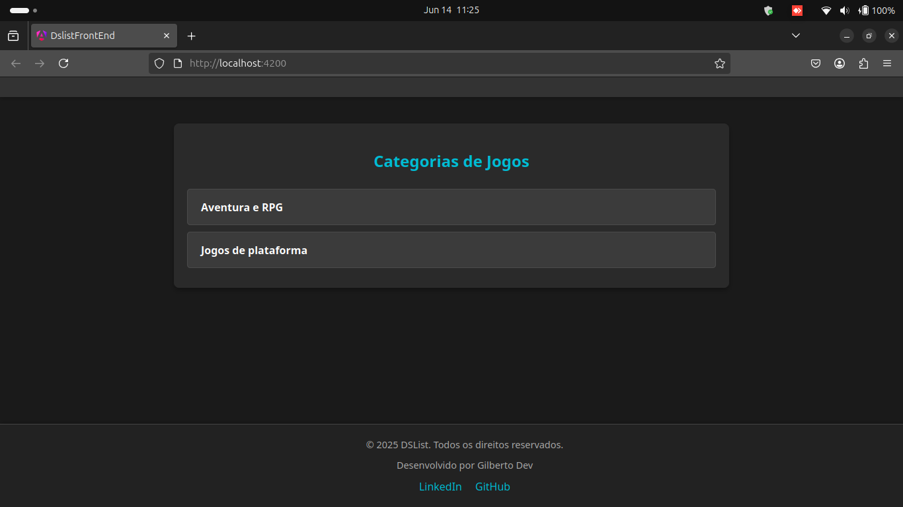
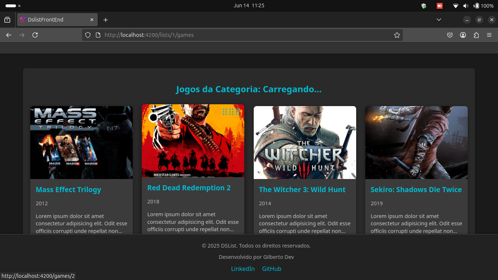
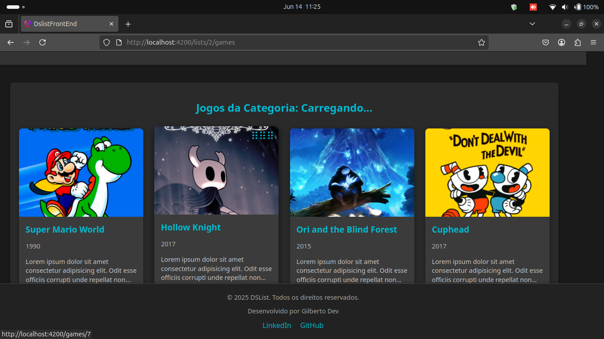

[English](https://github.com/Gilberto-Mascena/dslist/blob/main/README.md) |
[Português Brasileiro](https://github.com/Gilberto-Mascena/dslist/blob/main/README-pt_br.md)


[](https://github.com/Gilberto-Mascena/dslist/actions)
[](https://github.com/Gilberto-Mascena/dslist/blob/main/LICENSE.md)
[](https://github.com/Gilberto-Mascena/dslist/stargazers)
[](https://github.com/Gilberto-Mascena/dslist/issues)
[](https://github.com/Gilberto-Mascena/dslist/releases)


## About the Project

### This project is part of the _Java and Spring Boot Intensive Course_, focusing on Java back-end development. The goal is to build a back-end application with a database to manage a list of games, using Java and the Spring Boot framework.

## Features

- **CRUD operations to manage game data**
- **H2 and PostgreSQL database support**
- **Environment-based configuration**
- **API testing with Postman or Insomnia**
- **Docker integration**

## Class Diagram


## Estructure of the Project

```plantext
├── assets
│   ├── DSList API.postman_collection.json
│   ├── dslist-home.png
│   ├── dslist-page-1.png
│   ├── dslist-page-2.png
│   └── uml.png
├── changelog.md
├── LICENSE.md
├── mvnw
├── mvnw.cmd
├── pom.xml
├── README.md
├── README-pt_br.md
├── sample.env
├── src
│   ├── main
│   │   ├── java
│   │   │   └── br
│   │   │       └── com
│   │   │           └── gilbertodev
│   │   │               └── dslist
│   │   │                   ├── config
│   │   │                   │   ├── SwaggerConfig.java
│   │   │                   │   └── WebConfig.java
│   │   │                   ├── controllers
│   │   │                   │   ├── exceptions
│   │   │                   │   │   ├── GlobalExceptionHandler.java
│   │   │                   │   │   └── StandardError.java
│   │   │                   │   ├── GameController.java
│   │   │                   │   └── GameListController.java
│   │   │                   ├── DslistApplication.java
│   │   │                   ├── dto
│   │   │                   │   ├── GameDTO.java
│   │   │                   │   ├── GameListDTO.java
│   │   │                   │   ├── GameMinDTO.java
│   │   │                   │   └── ReplacementDTO.java
│   │   │                   ├── entities
│   │   │                   │   ├── Belonging.java
│   │   │                   │   ├── BelongingPK.java
│   │   │                   │   ├── Game.java
│   │   │                   │   └── GameList.java
│   │   │                   ├── exceptions
│   │   │                   │   ├── GameNotFoundException.java
│   │   │                   │   └── InvalidMoveException.java
│   │   │                   ├── projections
│   │   │                   │   └── GameMinProjection.java
│   │   │                   ├── repositories
│   │   │                   │   ├── GameListRepository.java
│   │   │                   │   └── GameRepository.java
│   │   │                   └── services
│   │   │                       ├── GameListService.java
│   │   │                       └── GameService.java
│   │   └── resources
│   │       ├── application-dev.yml
│   │       ├── application-prod.yml
│   │       ├── application-test.yml
│   │       ├── application.yml
│   │       └── import.sql
│   └── test
│       └── java
│           └── br
│               └── com
│                   └── gilbertodev
│                       └── dslist
│                           ├── common
│                           │   └── GameConstants.java
│                           └── service
│                               └── GameServiceTest.java

```

## Front-end Images

---

---


## Functionalities
- **List all games**
- **Search game by ID**
- **Move game in list**
- **List games in category**
- **List by category**

## Technologies used
- [Java 17](https://www.oracle.com/br/java/technologies/downloads/)
- [Spring Boot](https://spring.io/projects/spring-boot)
- [Maven](https://maven.apache.org/)
- [H2 Database](https://www.h2database.com/html/main.html)
- [Postgres](https://www.postgresql.org/)
- [UML](https://www.uml.org/)
- [Docker](https://www.docker.com/)
- [Git](https://git-scm.com/)

## Prerequisites

- [Java 17 or higher](https://www.oracle.com/br/java/technologies/downloads/)
- [Maven](https://maven.apache.org/)
- [Postman](https://www.postman.com/) or [Insomnia](https://insomnia.rest/download) to test the API.
- [Git](https://git-scm.com/)

## Running the Project

- Cloning the Repository

```bash
    git clone git@github.com:Gilberto-Mascena/dslist.git
    cd dslist
```

```bash
    mvn clean install
```

```bash
    mvn spring-boot:run
```

- Access the database at: http://localhost:8080/h2-console

- Configure the JDBC URL with ``jdbc:h2:mem:devdb``, username ``sa`` and click Connect.

- Run the SQL script:

```sql
INSERT INTO tb_game_list (name) VALUES ('Aventura e RPG');
INSERT INTO tb_game_list (name) VALUES ('Jogos de plataforma');

INSERT INTO tb_game (title, score, game_year, genre, platforms, img_url, short_description, long_description) VALUES ('Mass Effect Trilogy', 4.8, 2012, 'Role-playing (RPG), Shooter', 'XBox, Playstation, PC', 'https://raw.githubusercontent.com/devsuperior/java-spring-dslist/main/resources/1.png', 'Lorem ipsum dolor sit amet consectetur adipisicing elit. Odit esse officiis corrupti unde repellat non quibusdam! Id nihil itaque ipsum!', 'Lorem ipsum dolor sit amet consectetur adipisicing elit. Delectus dolorum illum placeat eligendi, quis maiores veniam. Incidunt dolorum, nisi deleniti dicta odit voluptatem nam provident temporibus reprehenderit blanditiis consectetur tenetur. Dignissimos blanditiis quod corporis iste, aliquid perspiciatis architecto quasi tempore ipsam voluptates ea ad distinctio, sapiente qui, amet quidem culpa.');
INSERT INTO tb_game (title, score, game_year, genre, platforms, img_url, short_description, long_description) VALUES ('Red Dead Redemption 2', 4.7, 2018, 'Role-playing (RPG), Adventure', 'XBox, Playstation, PC', 'https://raw.githubusercontent.com/devsuperior/java-spring-dslist/main/resources/2.png', 'Lorem ipsum dolor sit amet consectetur adipisicing elit. Odit esse officiis corrupti unde repellat non quibusdam! Id nihil itaque ipsum!', 'Lorem ipsum dolor sit amet consectetur adipisicing elit. Delectus dolorum illum placeat eligendi, quis maiores veniam. Incidunt dolorum, nisi deleniti dicta odit voluptatem nam provident temporibus reprehenderit blanditiis consectetur tenetur. Dignissimos blanditiis quod corporis iste, aliquid perspiciatis architecto quasi tempore ipsam voluptates ea ad distinctio, sapiente qui, amet quidem culpa.');
INSERT INTO tb_game (title, score, game_year, genre, platforms, img_url, short_description, long_description) VALUES ('The Witcher 3: Wild Hunt', 4.7, 2014, 'Role-playing (RPG), Adventure', 'XBox, Playstation, PC', 'https://raw.githubusercontent.com/devsuperior/java-spring-dslist/main/resources/3.png', 'Lorem ipsum dolor sit amet consectetur adipisicing elit. Odit esse officiis corrupti unde repellat non quibusdam! Id nihil itaque ipsum!', 'Lorem ipsum dolor sit amet consectetur adipisicing elit. Delectus dolorum illum placeat eligendi, quis maiores veniam. Incidunt dolorum, nisi deleniti dicta odit voluptatem nam provident temporibus reprehenderit blanditiis consectetur tenetur. Dignissimos blanditiis quod corporis iste, aliquid perspiciatis architecto quasi tempore ipsam voluptates ea ad distinctio, sapiente qui, amet quidem culpa.');
INSERT INTO tb_game (title, score, game_year, genre, platforms, img_url, short_description, long_description) VALUES ('Sekiro: Shadows Die Twice', 3.8, 2019, 'Role-playing (RPG), Adventure', 'XBox, Playstation, PC', 'https://raw.githubusercontent.com/devsuperior/java-spring-dslist/main/resources/4.png', 'Lorem ipsum dolor sit amet consectetur adipisicing elit. Odit esse officiis corrupti unde repellat non quibusdam! Id nihil itaque ipsum!', 'Lorem ipsum dolor sit amet consectetur adipisicing elit. Delectus dolorum illum placeat eligendi, quis maiores veniam. Incidunt dolorum, nisi deleniti dicta odit voluptatem nam provident temporibus reprehenderit blanditiis consectetur tenetur. Dignissimos blanditiis quod corporis iste, aliquid perspiciatis architecto quasi tempore ipsam voluptates ea ad distinctio, sapiente qui, amet quidem culpa.');
INSERT INTO tb_game (title, score, game_year, genre, platforms, img_url, short_description, long_description) VALUES ('Ghost of Tsushima', 4.6, 2012, 'Role-playing (RPG), Adventure', 'XBox, Playstation, PC', 'https://raw.githubusercontent.com/devsuperior/java-spring-dslist/main/resources/5.png', 'Lorem ipsum dolor sit amet consectetur adipisicing elit. Odit esse officiis corrupti unde repellat non quibusdam! Id nihil itaque ipsum!', 'Lorem ipsum dolor sit amet consectetur adipisicing elit. Delectus dolorum illum placeat eligendi, quis maiores veniam. Incidunt dolorum, nisi deleniti dicta odit voluptatem nam provident temporibus reprehenderit blanditiis consectetur tenetur. Dignissimos blanditiis quod corporis iste, aliquid perspiciatis architecto quasi tempore ipsam voluptates ea ad distinctio, sapiente qui, amet quidem culpa.');
INSERT INTO tb_game (title, score, game_year, genre, platforms, img_url, short_description, long_description) VALUES ('Super Mario World', 4.7, 1990, 'Platform', 'Super Ness, PC', 'https://raw.githubusercontent.com/devsuperior/java-spring-dslist/main/resources/6.png', 'Lorem ipsum dolor sit amet consectetur adipisicing elit. Odit esse officiis corrupti unde repellat non quibusdam! Id nihil itaque ipsum!', 'Lorem ipsum dolor sit amet consectetur adipisicing elit. Delectus dolorum illum placeat eligendi, quis maiores veniam. Incidunt dolorum, nisi deleniti dicta odit voluptatem nam provident temporibus reprehenderit blanditiis consectetur tenetur. Dignissimos blanditiis quod corporis iste, aliquid perspiciatis architecto quasi tempore ipsam voluptates ea ad distinctio, sapiente qui, amet quidem culpa.');
INSERT INTO tb_game (title, score, game_year, genre, platforms, img_url, short_description, long_description) VALUES ('Hollow Knight', 4.6, 2017, 'Platform', 'XBox, Playstation, PC', 'https://raw.githubusercontent.com/devsuperior/java-spring-dslist/main/resources/7.png', 'Lorem ipsum dolor sit amet consectetur adipisicing elit. Odit esse officiis corrupti unde repellat non quibusdam! Id nihil itaque ipsum!', 'Lorem ipsum dolor sit amet consectetur adipisicing elit. Delectus dolorum illum placeat eligendi, quis maiores veniam. Incidunt dolorum, nisi deleniti dicta odit voluptatem nam provident temporibus reprehenderit blanditiis consectetur tenetur. Dignissimos blanditiis quod corporis iste, aliquid perspiciatis architecto quasi tempore ipsam voluptates ea ad distinctio, sapiente qui, amet quidem culpa.');
INSERT INTO tb_game (title, score, game_year, genre, platforms, img_url, short_description, long_description) VALUES ('Ori and the Blind Forest', 4, 2015, 'Platform', 'XBox, Playstation, PC', 'https://raw.githubusercontent.com/devsuperior/java-spring-dslist/main/resources/8.png', 'Lorem ipsum dolor sit amet consectetur adipisicing elit. Odit esse officiis corrupti unde repellat non quibusdam! Id nihil itaque ipsum!', 'Lorem ipsum dolor sit amet consectetur adipisicing elit. Delectus dolorum illum placeat eligendi, quis maiores veniam. Incidunt dolorum, nisi deleniti dicta odit voluptatem nam provident temporibus reprehenderit blanditiis consectetur tenetur. Dignissimos blanditiis quod corporis iste, aliquid perspiciatis architecto quasi tempore ipsam voluptates ea ad distinctio, sapiente qui, amet quidem culpa.');
INSERT INTO tb_game (title, score, game_year, genre, platforms, img_url, short_description, long_description) VALUES ('Cuphead', 4.6, 2017, 'Platform', 'XBox, Playstation, PC', 'https://raw.githubusercontent.com/devsuperior/java-spring-dslist/main/resources/9.png', 'Lorem ipsum dolor sit amet consectetur adipisicing elit. Odit esse officiis corrupti unde repellat non quibusdam! Id nihil itaque ipsum!', 'Lorem ipsum dolor sit amet consectetur adipisicing elit. Delectus dolorum illum placeat eligendi, quis maiores veniam. Incidunt dolorum, nisi deleniti dicta odit voluptatem nam provident temporibus reprehenderit blanditiis consectetur tenetur. Dignissimos blanditiis quod corporis iste, aliquid perspiciatis architecto quasi tempore ipsam voluptates ea ad distinctio, sapiente qui, amet quidem culpa.');
INSERT INTO tb_game (title, score, game_year, genre, platforms, img_url, short_description, long_description) VALUES ('Sonic CD', 4, 1993, 'Platform', 'Sega CD, PC', 'https://raw.githubusercontent.com/devsuperior/java-spring-dslist/main/resources/10.png', 'Lorem ipsum dolor sit amet consectetur adipisicing elit. Odit esse officiis corrupti unde repellat non quibusdam! Id nihil itaque ipsum!', 'Lorem ipsum dolor sit amet consectetur adipisicing elit. Delectus dolorum illum placeat eligendi, quis maiores veniam. Incidunt dolorum, nisi deleniti dicta odit voluptatem nam provident temporibus reprehenderit blanditiis consectetur tenetur. Dignissimos blanditiis quod corporis iste, aliquid perspiciatis architecto quasi tempore ipsam voluptates ea ad distinctio, sapiente qui, amet quidem culpa.');

INSERT INTO tb_belonging (list_id, game_id, position) VALUES (1, 1, 0);
INSERT INTO tb_belonging (list_id, game_id, position) VALUES (1, 2, 1);
INSERT INTO tb_belonging (list_id, game_id, position) VALUES (1, 3, 2);
INSERT INTO tb_belonging (list_id, game_id, position) VALUES (1, 4, 3);
INSERT INTO tb_belonging (list_id, game_id, position) VALUES (1, 5, 4);

INSERT INTO tb_belonging (list_id, game_id, position) VALUES (2, 6, 0);
INSERT INTO tb_belonging (list_id, game_id, position) VALUES (2, 7, 1);
INSERT INTO tb_belonging (list_id, game_id, position) VALUES (2, 8, 2);
INSERT INTO tb_belonging (list_id, game_id, position) VALUES (2, 9, 3);
INSERT INTO tb_belonging (list_id, game_id, position) VALUES (2, 10, 4);
```

## API Testing

- With the project running.
- Import the [Collection-postman](/assets/DSList%20API.postman_collection.json)
- Directly in the browser.
  http://localhost:8080/games

## API Documentation
- With the project running.
- Access the address: http://localhost:8080/swagger-ui.html

## 📜 *License*

*This project is licensed under the MIT License. See more details at:* [_LICENSE.md_](./LICENSE.md)

### Gilberto | Dev _2023_